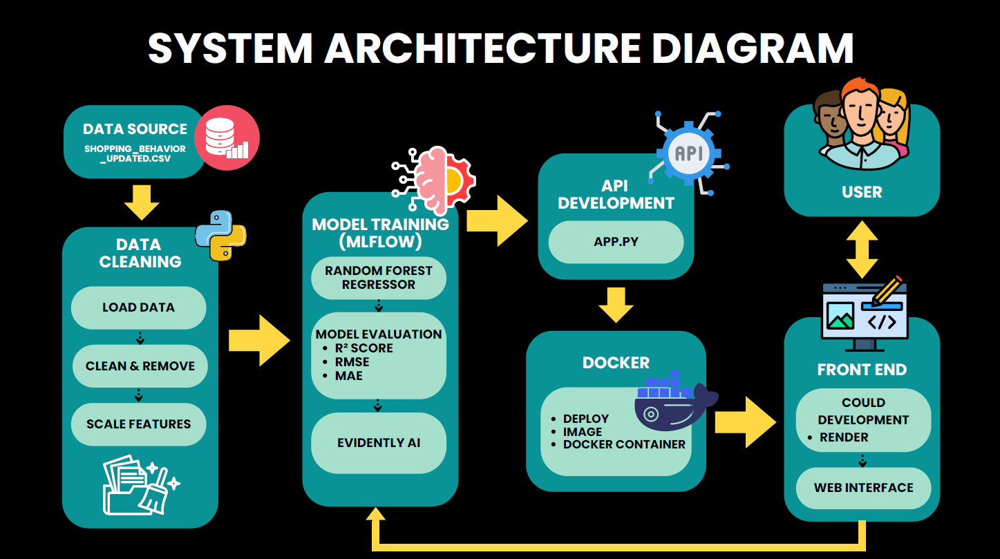

# Prediction of Real Estate Prices in Bangkok

An end-to-end machine-learning and MLOps portfolio project that estimates Bangkok residential property prices and serves predictions through a FastAPI web application.

> This repository is intended for learning and portfolio demonstration. Its output is not a professional property valuation.

## Overview

The project covers exploratory analysis, feature engineering, Random Forest regression, experiment tracking, model monitoring, API development, containerization, and cloud deployment.

The deployed model accepts:

- Property area in square feet
- Number of bedrooms
- Number of bathrooms
- Property type: apartment, condo, or house

It returns an estimated property price in Thai baht.

## Final output

**[Open the live Bangkok Property Price Predictor](https://nadchima.github.io/Prediction-Real-Estate-Prices-in-Bangkok/)**

The final result is available as an interactive web application. Enter the property's area, number of bedrooms and bathrooms, and property type to receive an estimated Bangkok property price in Thai baht. The interface connects directly to the deployed FastAPI prediction service.

### System architecture



## Dataset

| Item | Value |
|---|---:|
| Records | 563 |
| Raw columns | 6 |
| Property types | 3 |
| Bangkok locations | 10 |
| Missing values | 0 |
| Duplicate rows | 347 |

The available fields are property type, location, area, bedrooms, bathrooms, and price. The current production model excludes `Location`, despite location being part of the broader business problem.

## Workflow

```text
CSV data
  -> validation and exploratory analysis
  -> one-hot encoding of property type
  -> train-test split
  -> Random Forest regression
  -> MLflow experiment tracking
  -> Evidently monitoring prototype
  -> serialized model
  -> FastAPI + HTML interface
  -> Docker deployment
```

## Model results

The latest notebook run reports the following random row-split results:

| Metric | Result |
|---|---:|
| R² | 0.9909 |
| RMSE | THB 255,138 |
| MAE | THB 107,464 |

These figures are provisional. Because 347 of 563 rows are exact duplicates, the same property pattern can appear in both training and test sets and inflate performance. The presentation contains an older run with R² 0.9363, RMSE THB 674,391, and MAE THB 288,496. A publishable model should deduplicate or group identical records before splitting and should report one reproducible final run.

## API

### Health check

```http
GET /health
```

### Prediction

```http
POST /predict
Content-Type: application/json

{
  "area_sqft": 850,
  "no_bedroom": 2,
  "no_bathroom": 1,
  "property_type": "Condo"
}
```

Example response:

```json
{
  "predicted_price_thb": 3300000,
  "message": "Predicted price for a Condo of 850 sq.ft."
}
```

## Run with Docker

```bash
docker compose up --build
```

Then open `http://localhost:8501`. API documentation is available at `/docs` when the static front-end mount is registered after the API routes.

## Run without Docker

```bash
pip install -r requirements.txt
uvicorn app:app --host 0.0.0.0 --port 8501
```

Open `http://localhost:8501` for the web interface, `http://localhost:8501/docs` for the interactive API documentation, or `http://localhost:8501/health` for the health check.

## Explore the analysis

- Dataset: [`Bangkok Housing Condo Apartment Prices.csv`](./Bangkok%20Housing%20Condo%20Apartment%20Prices.csv)
- Reproducible notebook: [`notebooks/Bangkok_Housing_Condo_Apartment_Prices.ipynb`](./notebooks/Bangkok_Housing_Condo_Apartment_Prices.ipynb)
- Project reports: the two PDF files in the repository root

The public notebook has its cell outputs cleared and reads optional GitHub/ngrok credentials from environment variables. Never commit access tokens directly to a notebook.

## Deployment components

```text
.
├── app.py
├── Bangkok Housing Condo Apartment Prices.csv
├── Dockerfile
├── docker-compose.yml
├── render.yaml
├── requirements.txt
├── frontend/
│   └── index.html
├── models/
│   └── bkk_condo_prices-v1.pkl
└── notebooks/
    └── Bangkok_Housing_Condo_Apartment_Prices.ipynb
```

## MLOps components demonstrated

- MLflow for experiment parameters, metrics, and model artifacts
- Evidently for data-quality and drift-report prototyping
- DVC workflow experiments for dataset versioning
- Docker for reproducible serving
- Render configuration for cloud deployment

## Limitations and next steps

- Remove or group duplicate records before evaluation.
- Add location and transit-access features to match the stated business objective.
- Use a preprocessing-and-model pipeline so training and inference share one schema.
- Compare Random Forest with gradient boosting and a transparent linear baseline.
- Add cross-validation, prediction intervals, request logging, and automated tests.
- Restrict CORS in production and validate plausible upper bounds for every numeric input.
- Treat the output as a portfolio estimate, not a certified property valuation.

